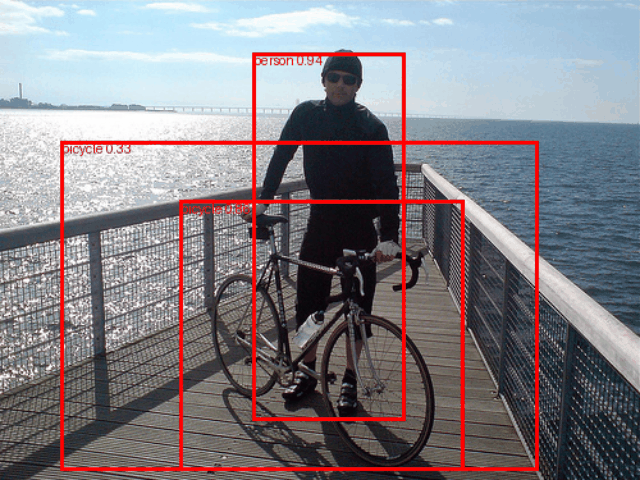

# Custom Faster R-CNN Training from Scratch (PASCAL VOC)

This project implements an end-to-end Object Detection pipeline using PyTorch. It trains a **Faster R-CNN** model with a **MobileNetV3** backbone entirely from scratch (no pre-trained ImageNet weights).

## 🎥 Results
**Inference Speed:** 31.37 FPS  
**Visualization:**



## 🛠 Model Architecture
* **Architecture:** Faster R-CNN
* **Backbone:** MobileNetV3-Large FPN
* **Classes:** 20 (PASCAL VOC) + 1 Background
* **Input Resolution:** Dynamic (Resized for batching)

## 🚀 How to Run
1. **Install Dependencies:**
   ```bash
   pip install torch torchvision opencv-python imageio tqdm
Train the Model:

Python

# Ensure PASCAL VOC dataset is downloaded
python train.py
📊 Methodology
Gradient Clipping: Used to stabilize training from random initialization.

Data Sanitization: Custom loader filters invalid XML annotations.

Optimization: SGD with Momentum and Learning Rate Scheduling.

📂 Project Structure
train.py: Complete training, evaluation, and visualization pipeline.

voc_model_scratch.pth: Saved model weights (72MB).

detection_results.gif: Inference demo.